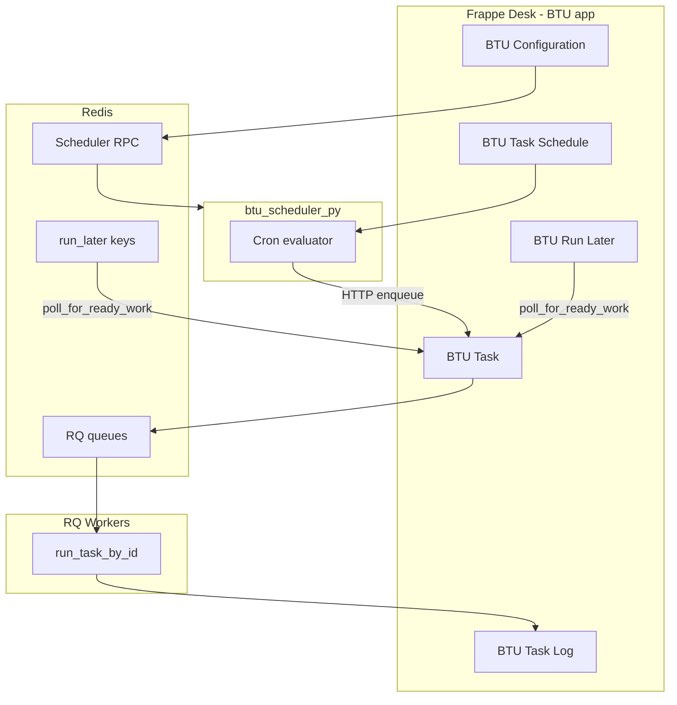

# Mental model

BTU is one product with four runtime pieces:

## Data flow for a scheduled task

1. User creates a **BTU Task** (function path + arguments) and **BTU Task Schedule** (cron, timezone).
2. **Scheduler daemon** reads enabled schedules from the database, computes next run times.
3. At fire time, scheduler calls Frappe to enqueue the task on RQ.
4. **RQ worker** runs `btu.btu_core.task_runner.run_task_by_id`, which executes the Python function and writes a **BTU Task Log**.

## Control vs execution

| Plane | Component | Responsibility |
|-------|-----------|----------------|
| System of record | Frappe app | Tasks, Schedules, Logs, permissions, Desk |
| Time engine | Scheduler daemon | Cron evaluation, fire-at-time enqueue |
| Execution | RQ workers | Run Python callables |
| Transport | Redis | Job queues + scheduler RPC |

## Why two GitHub repos?

See [Why BTU](../get-started/why-btu.md) and [Technical design](../internals/technical-design.md).
