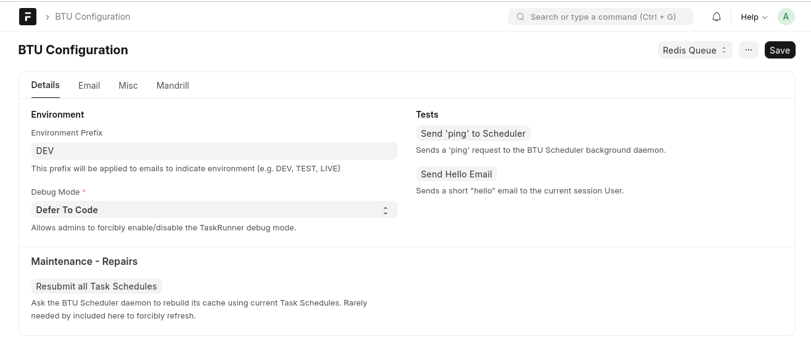
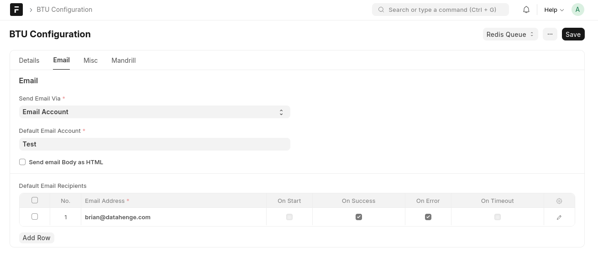
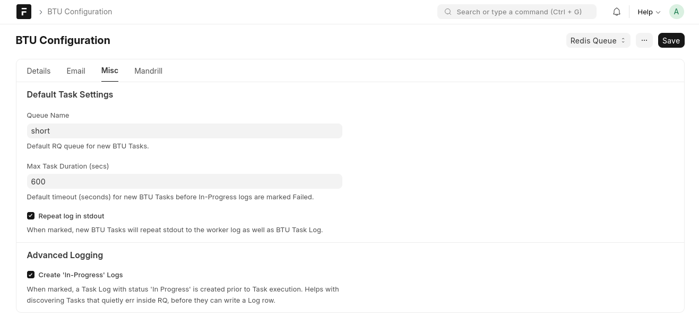

# BTU Configuration

Singleton settings for BTU and scheduler integration.

## Details tab

<figure class="btu-screenshot" markdown="span">

<figcaption>BTU Configuration — Details tab: environment prefix, debug mode, scheduler tests, and maintenance actions</figcaption>
</figure>

### Environment

| Field | Purpose |
|-------|---------|
| Environment Prefix | Prefix added to email subjects to indicate environment (e.g. `DEV`, `TEST`, `LIVE`) |
| Debug Mode | Override TaskRunner debug verbosity: *Defer To Code*, *Force On*, or *Force Off* |

### Tests

| Button | Purpose |
|--------|---------|
| Send 'ping' to Scheduler | Sends a ping request to the BTU Scheduler daemon via Redis RPC |
| Send Hello Email | Sends a short test email to the current session user |

### Maintenance — Repairs

| Button | Purpose |
|--------|---------|
| Resubmit all Task Schedules | Tells the scheduler daemon to rebuild its cache from current Task Schedules |

## Email tab

<figure class="btu-screenshot" markdown="span">

<figcaption>BTU Configuration — Email tab: provider, default account, and default recipients</figcaption>
</figure>

| Field | Purpose |
|-------|---------|
| Default Email Account | Frappe Email Account used for outgoing notifications |
| Send email Body as HTML | When checked, notification bodies are formatted as HTML |
| Default Email Recipients | Table of addresses with per-event checkboxes: On Start, On Success, On Error, On Timeout |

!!! note
    SMTP fields were removed in BTU 15.2. Configure outgoing mail through a Frappe Email Account instead.

## Misc tab

<figure class="btu-screenshot" markdown="span">

<figcaption>BTU Configuration — Misc tab: default task settings and advanced logging options</figcaption>
</figure>

### Default Task Settings

| Field | Purpose |
|-------|---------|
| Queue Name | Default RQ queue assigned to new BTU Tasks (e.g. `short`, `default`, `long`) |
| Max Task Duration (secs) | Default timeout; In-Progress logs are marked Failed after this many seconds |
| Repeat log in stdout | When checked, task stdout is routed to both the BTU Task Log and the worker stdout |

### Advanced Logging

| Option | Purpose |
|--------|---------|
| Create 'In-Progress' Logs | Creates a Task Log with status *In Progress* before execution — useful for catching tasks that fail before they can write their own log row |

## Documentation link

The form links to [https://btu.datahenge.com/](https://btu.datahenge.com/).
