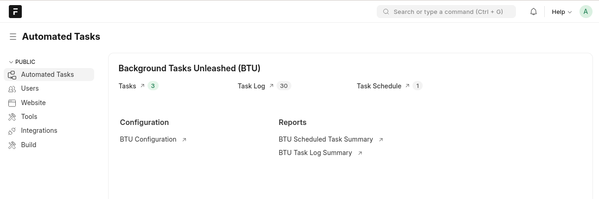

# Desk guides

BTU DocTypes in the Frappe Desk.

<figure class="btu-screenshot" markdown="span">

<figcaption>The BTU workspace — quick links to Tasks, Task Log, Task Schedule, Configuration, and Reports</figcaption>
</figure>

| DocType | Guide |
|---------|-------|
| BTU Configuration | [configuration.md](configuration.md) |
| BTU Task | [task.md](task.md) |
| BTU Task Schedule | [task-schedule.md](task-schedule.md) |
| BTU Task Log | [task-log.md](task-log.md) |
| BTU Run Later | [run-later.md](run-later.md) |

Open the **Automated Tasks** workspace for quick navigation.
