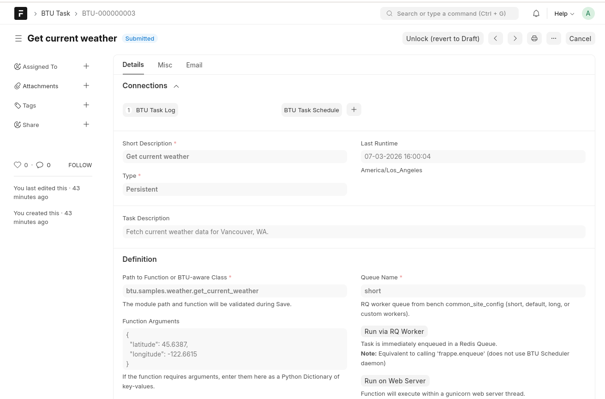
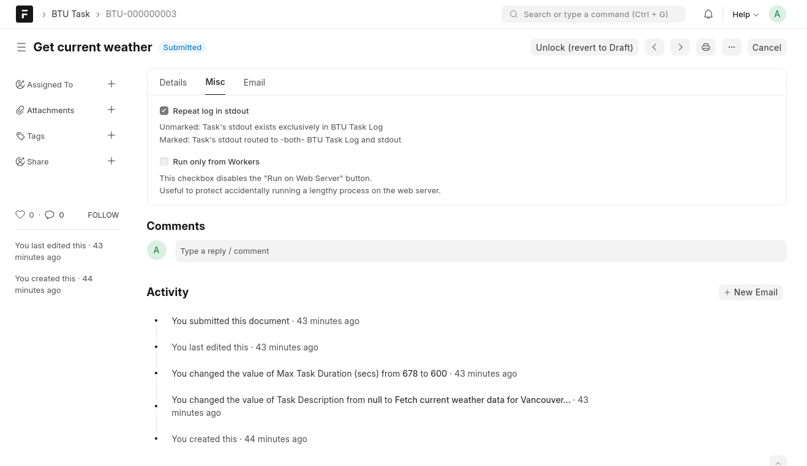
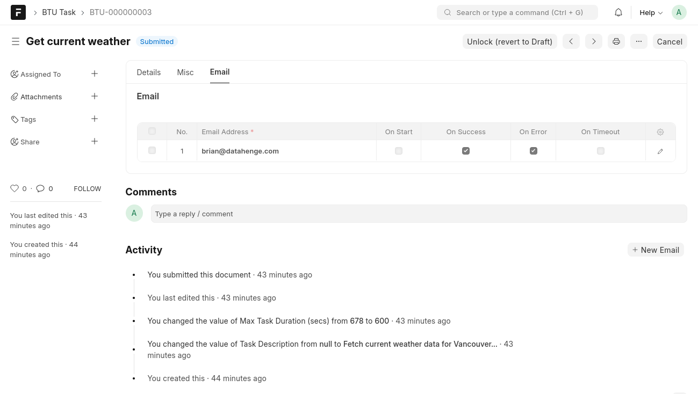

# BTU Task

Defines a callable Python job. Tasks are **submitted** documents — they must be in *Submitted* state before they can run.

## Details tab

<figure class="btu-screenshot" markdown="span">

<figcaption>BTU Task — Details tab: function path, arguments, run buttons, and linked logs/schedules</figcaption>
</figure>

### Header fields

| Field | Purpose |
|-------|---------|
| Short Description | Human-readable name for the task |
| Type | *Persistent* (saved Task document) or *Ad Hoc* |
| Task Description | Optional free-text description |
| Last Runtime | Timestamp of most recent execution |

### Definition

| Field | Purpose |
|-------|---------|
| Path to Function or BTU-aware Class | Dotted Python import path, e.g. `btu.samples.weather.get_current_weather`. Validated on save. |
| Queue Name | RQ worker queue: `short`, `default`, `long`, or a custom queue name |
| Function Arguments | JSON key-value pairs passed as kwargs to the function |
| Max Task Duration (secs) | Per-task timeout override; inherits from BTU Configuration when blank |

### Run buttons

| Button | Behaviour |
|--------|-----------|
| Run via RQ Worker | Enqueues the task in Redis immediately — equivalent to `frappe.enqueue`. Does **not** use the BTU Scheduler daemon. |
| Run on Web Server | Executes the function synchronously inside the gunicorn web server thread |

### Connections

The form shows linked **BTU Task Log** records (past executions) and **BTU Task Schedule** links at the top of the Details tab.

## Misc tab

<figure class="btu-screenshot" markdown="span">

<figcaption>BTU Task — Misc tab: stdout routing and worker-only execution flag</figcaption>
</figure>

| Option | Purpose |
|--------|---------|
| Repeat log in stdout | When checked, stdout from this task is written to both BTU Task Log *and* the worker's stdout. Overrides the BTU Configuration default for this task. |
| Run only from Workers | Disables the *Run on Web Server* button — useful to prevent accidentally running a long-running task on the web server. |

## Email tab

<figure class="btu-screenshot" markdown="span">

<figcaption>BTU Task — Email tab: per-task email recipients with event-level checkboxes</figcaption>
</figure>

The Email tab holds a child table of recipients specific to this task. Each row has four event checkboxes:

| Checkbox | Sends email when… |
|----------|-------------------|
| On Start | The task begins execution |
| On Success | The task completes with *Success* result |
| On Error | The task completes with an error result |
| On Timeout | The task is marked timed-out by the housekeeping job |

Recipients here are merged with the Default Email Recipients in BTU Configuration.

## Samples

See [`btu/samples/`](https://github.com/Datahenge/btu/tree/main/btu/samples) in the app repository for example target functions.
