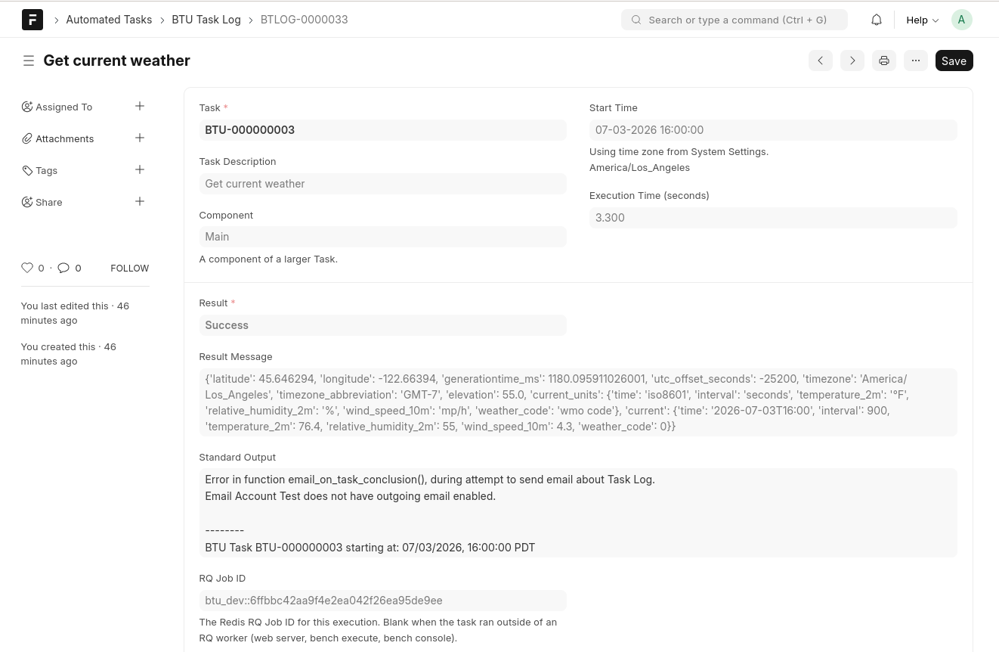

# Automate the work your business repeats

**Background Tasks Unleashed (BTU)** turns routine back-office work into scheduled,
observable automation inside [Frappe](https://frappeframework.com) and ERPNext — all
configured from the Desk, with no code deploys.

If someone logs in every morning (or every month-end) to run the same report, send the
same emails, or push the same documents, that job belongs in BTU.

## What teams automate with BTU

- :material-receipt-text-outline:{ .lg .middle } &nbsp;**Automatic invoicing**

    ---

    Generate customer invoices on a schedule and email them the moment they're ready.

- :material-truck-fast-outline:{ .lg .middle } &nbsp;**Purchase orders to suppliers**

    ---

    Batch and dispatch POs to vendors overnight instead of clicking *Send* all day.

- :material-chart-box-outline:{ .lg .middle } &nbsp;**Scheduled reports**

    ---

    Build and deliver recurring reports to inboxes — daily, weekly, or month-end.

- :material-cash-multiple:{ .lg .middle } &nbsp;**Payment collection**

    ---

    Chase overdue invoices with automated reminders and collection runs.

- :material-database-sync-outline:{ .lg .middle } &nbsp;**Data syncs & integrations**

    ---

    Poll APIs, push data to partners, and keep external systems in step on a cron.

- :material-cog-play-outline:{ .lg .middle } &nbsp;**Any recurring Python job**

    ---

    Point BTU at a function, give it a schedule, and get full logs plus email alerts.

## See a real task — and its result

Every run records **exactly what happened** — the output it printed *and* the value it
returned — in a BTU Task Log you can open right from the Desk:

<figure class="btu-screenshot" markdown="span">

<figcaption>A completed BTU Task Log — <em>Standard Output</em> (what the task printed) and <em>Result Message</em> (what it returned)</figcaption>
</figure>

## Try it in 5 minutes

The fastest way to understand BTU is to run the built-in weather sample end to end:

[Your first task :material-arrow-right:](get-started/first-task.md){ .md-button .md-button--primary }
[Install BTU](get-started/installation.md){ .md-button }

## How it works

1. Define a **BTU Task** — a Python function path plus arguments.
2. Give it a **BTU Task Schedule** — cron timing with a per-schedule time zone.
3. The **BTU Scheduler** daemon fires the task at the right moment.
4. An **RQ worker** runs it and writes a **BTU Task Log** with output, result, and timing.

See the [mental model](concepts/mental-model.md) for the full picture.

## Quick start

| I want to… | Start here |
|------------|------------|
| Run my first task | [Your first task](get-started/first-task.md) |
| Install BTU end-to-end | [Installation](get-started/installation.md) |
| Understand the architecture | [Mental model](concepts/mental-model.md) |
| Set up the scheduler daemon | [BTU Scheduler](scheduler/index.md) |
| Configure email alerts | [Email integration](integrations/email.md) |

## The two components

BTU ships as two open-source pieces that work together:

1. **BTU Frappe app** ([Datahenge/btu](https://github.com/Datahenge/btu)) — the Desk UI: Tasks, Schedules, Logs, Run Later, and Configuration.
2. **BTU Scheduler** ([Datahenge/btu_scheduler_py](https://github.com/Datahenge/btu_scheduler_py)) — the cron engine that reads schedules and fires tasks at run time.

Both are required for recurring schedules. See the [BTU Scheduler](scheduler/index.md) section for setup.

## Requirements

- Frappe v15+ bench with Redis and RQ workers
- PostgreSQL or MariaDB (the scheduler reads the same site database)
- BTU Scheduler daemon running continuously (`btu-py run-daemon`)

ERPNext is **not** required.
