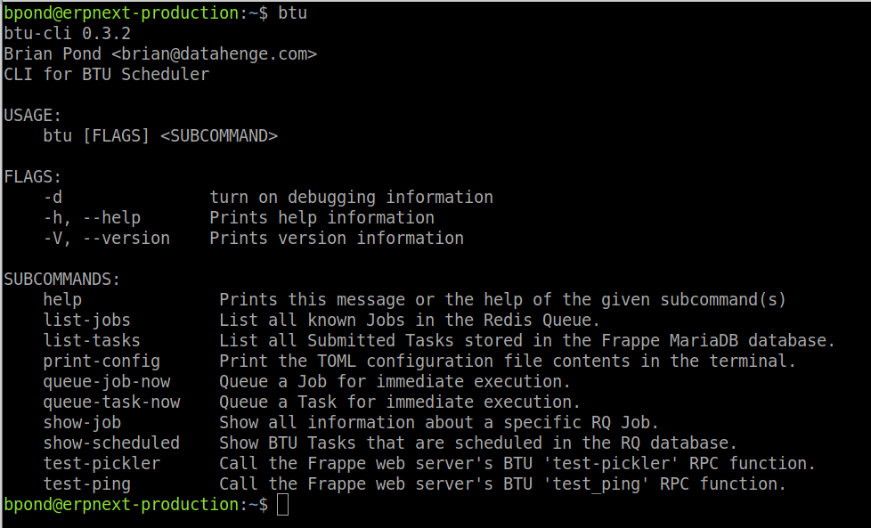

# Legacy Rust scheduler

The original BTU Scheduler ([btu_scheduler_daemon](https://github.com/Datahenge/btu_scheduler_daemon)) was a Rust binary distributed per Linux distribution.

<figure class="btu-screenshot" markdown="span">

<figcaption>The retired <code>btu-cli</code> 0.3.2 Rust binary — subcommands like <code>list-jobs</code>, <code>queue-task-now</code>, and <code>test-ping</code> are no longer available</figcaption>
</figure>

## Status: retired

Maintenance has ended. Reasons include cross-platform build burden (glibc variants, WSL, macOS) vs maintainer capacity.

## Replacement

Use **[btu_scheduler_py](https://github.com/Datahenge/btu_scheduler_py)** — Python daemon with PostgreSQL/MariaDB support and Redis RPC.

## Migration notes

- Control plane is **Redis RPC only** (Unix sockets removed from supported path in BTU 15.1+)
- Configuration is `BTU_SCHEDULER_*` environment variables, not `/etc/btu_scheduler/btu_scheduler.toml`
- Install and run via `btu-py run-daemon`

Do not start new deployments on the Rust binary.
